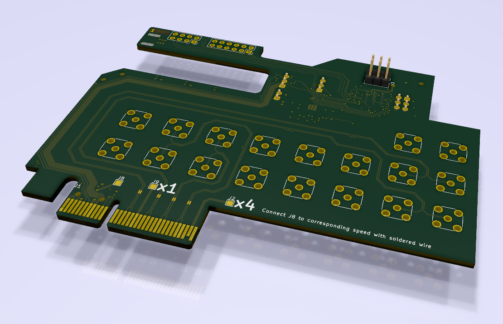

# ECP5 EVN to PCIe x4 adapter board
This is an adapter board for the ECP5 EVN, such that it can be used with PCIe x1 or x4. It has a PLL to double the incoming PCIe clock, since it has better jitter performance than the ones in the ECP5.
It also has an ATMega328 which is connected over UART to the ECP5 to save on interface pins and FPGA logic complexity for configuring the PLL.

