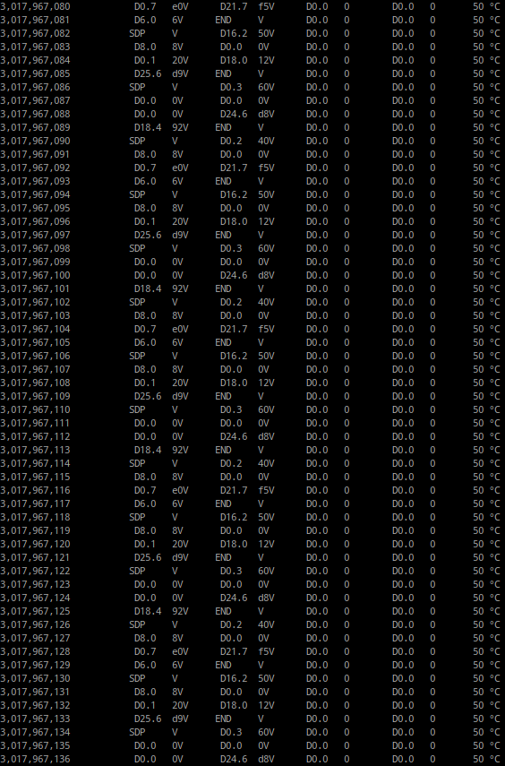

# ECP5-PCIe
## ECP5 to PCIe interface development
The goal of this project is to provide a PCIe interface in [Amaranth HDL](https://github.com/amaranth-lang/amaranth).
## Previous work
There already exists a PCIe physical layer by whitequark called [Yumewatari](https://github.com/whitequark/Yumewatari) and a TLP and DMA layer by enjoy-digital called [litepcie](https://github.com/enjoy-digital/litepcie/tree/master/litepcie) written in omigen.

## TODO
- Read through Yumewatari and litepcie code
- Read more of the PCIe spec and summarize relevant parts
- Get an ECP5 device capable of PCIe
	- Currently an adapter for the ECP5 EVN to PCIe is being built

## INSTALL
Execute `python setup.py develop` in the Gateware folder

## SIMULATE
- Execute `python test_pcie_virtual.py` in the Tests folder to run the simulation
- Execute `gtkwave test.gtkw` to view the results

## SETUP
https://github.com/ECP5-PCIe/ECP5-PCIe/wiki/Setup

If you have a Versa board, additionally run `openocd -f ispCLOCK/ispCLOCK-200MHz.cfg` to setup the ispCLOCK chip. For that you need to set J50 to connect pins 2-4 and 5-6. After you are done, set them back to 1-2 and 3-5.

## RUN
- Enable PCIe on the connected device (for example on the ROCKPro64 execute `pci init` in u-boot)
- Execute `python test_pcie_phy.py run` in the Tests folder to upload the gateware to the ECP5
- Execute `python test_pcie_phy.py grab` to get DLLPs received in the L0 state (and the time since it has been in the L0 state).
Sometimes the last few results are invalid and the program doesn't halt, end it by pressing `Ctrl + C`.
It should show something like this:

Data is composed of the first symbol received in one clock cycle, its representation in hexadecimal, the same for the second symbol.
The time is in clock cycles since entering L0, which are 8 ns each.
#### Time since L0 | RX data | TX data | Temperature

